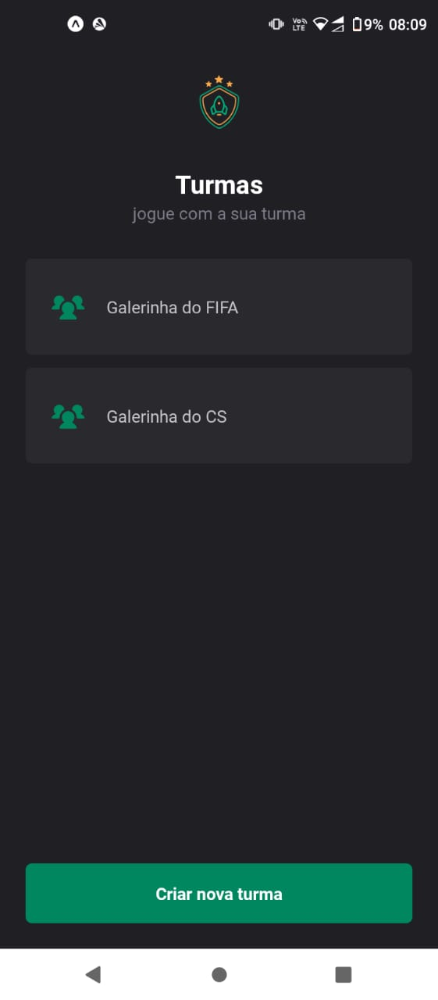
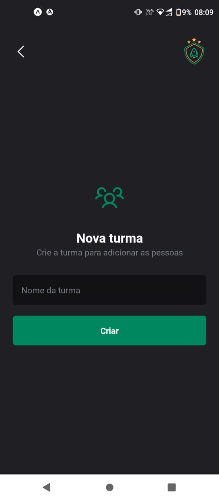
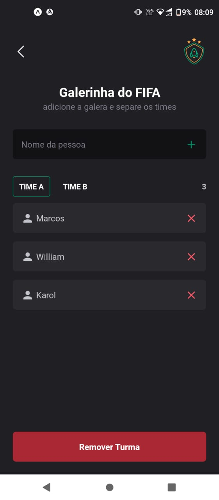

<h1 align="center" style="display:flex; justify-content:center; align-items:center">  Ignite Teams</h1>

## 💻 O Projeto
Projeto desenvolvido durante o bootcamp de React Native da Rocketseat, esse aplicativo tem como objetivo principal organizar os jogadores em seus respectivos grupos e times.

<h1 align="center" class="teste">
  
  
  
</h1>

## 👨‍💻 Tecnologias utilizadas
- React Native
- Expo
- Styled Components
- React Navigation

## Rodando o projeto
- Rode o comando `yarn` para instalar todas as dependências do projeto 
- Rode o comando `expo start` para abrir o painel do expo
- Com o expo instalado no seu smartphone, scaneie o Qr Code.

## 🤔 Como contribuir

- Faça um fork desse repositório;
- Cria uma branch com a sua feature: `git checkout -b minha-feature`;
- Faça commit das suas alterações: `git commit -m 'feat: Minha nova feature'`;
- Faça push para a sua branch: `git push origin minha-feature`.

---

Desenvolvido por [William José Dias!](https://github.com/WilliamWJD)